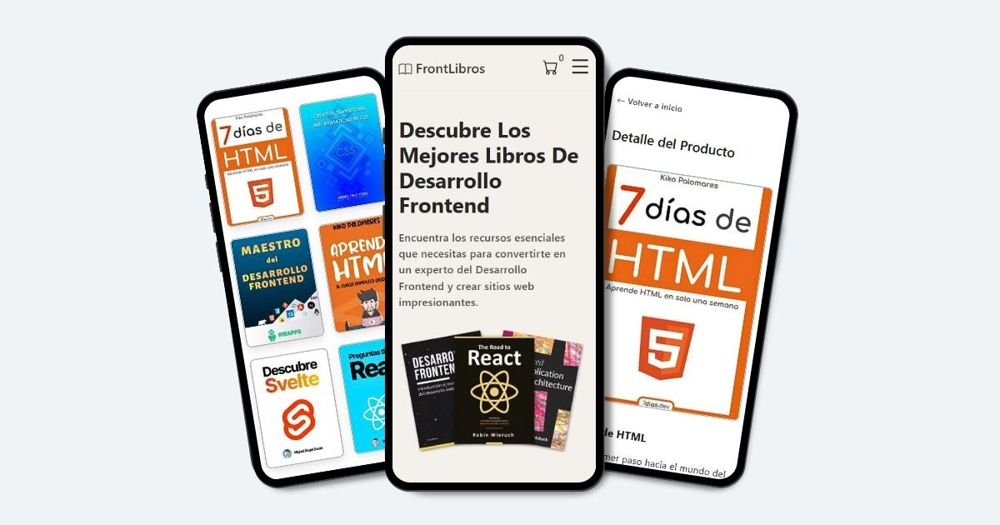

# FrontLibros: Descubre los mejores libros de Desarrollo Frontend

**FrontLibros** es una tienda en línea que ofrece libros digitales sobre Desarrollo Frontend.

## Vista previa

## Características

- **Filtro de categorías:** Encuentra libros según la tecnología que te interesa.

- **Ver carrito:** Consulta el contenido del carrito de compras.

- **Agregar producto:** Añade libros al carrito con un solo clic.

- **Eliminar producto:** Elimina libros del carrito de manera sencilla.

- **Notificación mediante modales:** Recibe notificaciones al agregar o eliminar productos, y tras una compra exitosa.

- **Simulación de compra:** Simula el proceso de compra.

- **Accesibilidad:** Optimizado para lectores de pantalla.

## Accesibilidad

**FrontLibros** garantiza una experiencia de compra accesible siguiendo las Pautas de Accesibilidad para el Contenido Web (WCAG). Para poder comprobar la accesibilidad del sitio, es necesario contar con un lector de pantalla como:

- **NVDA:** Instalable para Windows, gratuito.

- **Narrador de Windows:** Nativo de Windows.

- **TalkBack:** Nativo de Android.

- **VoiceOver:** Nativo de IOS y macOS.

## Tecnologías utilizadas

- **Vite:** Herramienta de construcción rápida para proyectos modernos.

- **React 18:** Biblioteca para construir interfaces de usuario interactivas.

- **CSS Modules:** Estilización de forma modular y encapsulada.

- **Cloudinary:** Alojamiento y gestión de imágenes.

## Explora el sitio web

Accede aquí → [FrontLibros](https://frontlibros.vercel.app/)

## Desarrollado por

**Luciano Treachi**

Soy un Desarrollador Frontend dedicado a crear soluciones web eficientes, accesibles, intuitivas y fáciles de usar que potencian la experiencia del usuario.

